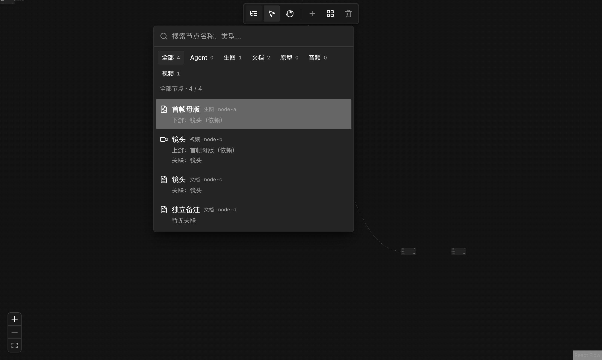
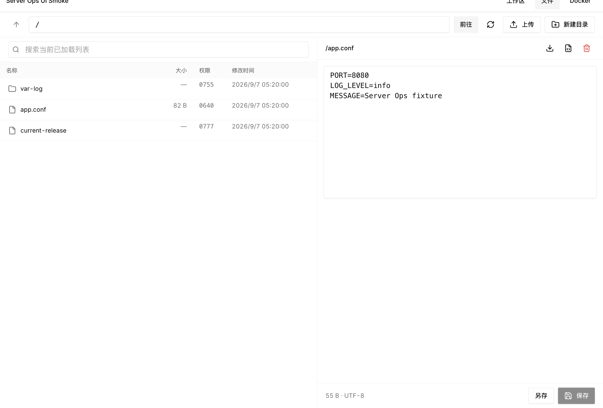
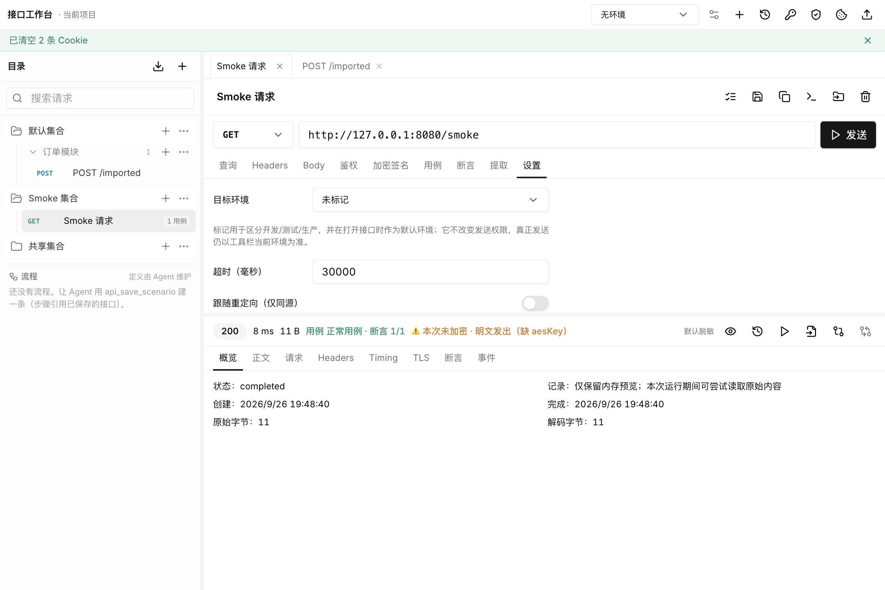

# DutyDeck

DutyDeck is a local-first engineering Agent workbench: on top of Proma's Chat, Agent, project workspaces, Skills, and MCP, it adds canvas orchestration, a server operations workbench, an API workbench, and today activity — gathering the project maintenance chores outside core development into one place, so attention can go back to the product. Data and settings stay on your own machine.


> **This repository is a modified edition of Proma.** DutyDeck evolves from the upstream open-source project [Proma](https://github.com/proma-ai/Proma) (AGPL-3.0-only) and is independently maintained by [kuangtao22](https://github.com/kuangtao22). It is not affiliated with, nor endorsed by, the official Proma project. See [Relationship To Upstream Proma](#relationship-to-upstream-proma) for the upstream baseline and differences.

[中文 README](./README.md) | [Proma Tutorial (upstream)](https://github.com/proma-ai/Proma/tree/main/tutorial) | [Changelog](./release-notes/bone) | [Download DutyDeck](https://github.com/kuangtao22/Proma/releases/latest)

## Why DutyDeck Exists

DutyDeck starts from a thank-you, and from a very concrete problem: individual developers want to focus on the product, but project maintenance chores keep chopping that focus into pieces.

**The thank-you goes to upstream Proma.** Back when Agent products were still rough, Proma had already turned the hard parts — dual Chat / Agent modes, project workspaces, Skills, MCP, collaboration sub-sessions, and an in-app browser — into an open-source product people could use every day, and it keeps maintaining them under AGPL-3.0. Chat, Agent, workspaces, memory, remote bridges, and local-first storage in this repository all come from Proma; without it, this repository would not exist.

**The problem is focus getting interrupted.** Building a product needs long, uninterrupted stretches of attention, yet running a project also comes with a pile of duties: watching servers and databases, integrating APIs, setting up environments and scripts, reading logs, shepherding releases, answering issues and docs. None of them is large on its own, but they are scattered across a terminal, a database client, an API tool, a cloud console, and a chat window, and every switch costs a context switch. By the time the chores are cleared, your attention no longer fits back into the product.

So the intent behind DutyDeck is one sentence: **give individual developers a focused workbench that gathers the duties outside core development into one place.** Agent, canvas, server operations, and API work share one local context, so you clear the chores there and give your attention back to the product; anything that needs your call stops in front of you as an approval card instead of showing up in an audit log afterwards. The name says the same thing: Duty + Deck, one deck for everything you are duty-bound to keep running.

We also set two boundaries for ourselves:

- **No changes to the upstream core**: the Agent runtime, IPC contracts, and data directory stay as Proma defines them, and extensions are added on top so upstream updates can keep merging.
- **No commercial exemptions**: this repository ships under AGPL-3.0-only and neither offers nor is able to offer a commercial license exemption.

## Why It Is Worth Using

DutyDeck is not about adding more features; it is about merging scattered maintenance work into one chain:

- **One client instead of a row of tools**: terminal, database client, API tooling, log panels, and file transfer live in the same window — one less context rebuild per tool switch.
- **The Agent gets real context**: it can see the server, database, request, or canvas you are looking at, instead of waiting for you to copy the screen into the chat.
- **Dangerous actions stop in front of you**: read-only by default, writes either emit a script or go through a per-item approval card, and credentials are encrypted locally so the Agent cannot take them for you.
- **Data stays on your machine**: conversations, workspaces, settings, and Skills live as JSON / JSONL under `~/.proma/`, canvas data travels with the project directory, and there is no local database.
- **Standing on Proma's shoulders**: Chat, Agent, workspaces, Skills, and MCP keep following upstream, extensions are added on top, and upstream fixes still merge in.

## Our Own Extensions

These four are built in this repository and are the main difference from upstream Proma. Each one gathers a family of scattered maintenance chores into a single place, and each has its own documentation page.

### Canvas — draw a multi-step delivery as one graph

Delivery is rarely one step: write copy, generate images, build a prototype, revise, revise again. Canvas uses nodes for steps and edges for dependencies, keeps versions and ownership on the artifacts, and lets you see at a glance which version is in use and what else must change. It is deliberately not a generic workflow engine; it is the multi-modal production surface for the ordinary Agent.

- Node types: Agent, image, document, and prototype (WebView); video is marked "coming soon".
- Three Agent roles: the ordinary Agent orchestrates, Canvas Agents own long-running branches, execution Agents run single generations.
- Artifacts become candidates first and only take effect once adopted: node cards and downstream consumers use the adopted version only.

Details: [Canvas documentation](./docs/extensions/canvas.md)

### Server Operations — ship and troubleshoot without leaving the client

Checking server load, reading logs, inspecting table structures, running one SQL statement, moving a file, glancing at containers — none of it is big, yet it keeps pulling you away from the product. The workbench gathers it into one panel and lets the Agent help only inside a read-only scope you explicitly granted, with the scope and remaining time shown in the UI.

- Connections: SSH (password / private key / SSH agent), MySQL, PostgreSQL, Redis, and local SQLite, organised by project.
- Servers: overview, remote terminal, systemd services, live logs, remote files and transfers, Docker.
- Databases: database and table browsing, paged rows, a SQL workbench with query history, read-only diagnostics; Redis provides connection and read-only diagnostics.
- Safety: credentials are encrypted locally and never echoed back; read-only by default, writes either emit a script or require per-item approval; Agent read grants are per session, expire after 30 minutes, and can be revoked at any time.

Details: [Server Operations documentation](./docs/extensions/server-ops.md)

### API Workbench — keep integration, auth, and cases in the project

API work is the most fragmented kind of maintenance: change the host per environment, auth spread across tools, cases buried in chat, and a failure that only says "401". The workbench separates configuration from evidence — collections hold reusable configuration, run records hold what actually happened — and both you and the Agent execute through the same pipeline, so every conclusion can be opened and verified.

- Organisation: collections / folders / requests, environments, and four levels of variable scope with the effective layer shown in the UI.
- Debugging: HTTP/1.1 and SSE, with full run records (final request headers, raw body bytes, phase timings, redirects, TLS, cookies, assertion results).
- Encryption and signing: profiles live in shared configuration and requests only select one; keys are referenced by variable name, and a missing key is honestly reported as "sent in plaintext".
- Agent: sending and saving are two separate approvals, repeated calls never resend, and Agent-authored cases cannot modify human-created ones.

Details: [API Workbench documentation](./docs/extensions/api-workbench.md)

### Today Activity — see what today actually produced

After a day of switching between projects and modes, memory is a poor answer to "what did I actually move forward today". Today Activity gathers the sessions that had conversations today across all projects into one time-ordered stream; one click returns you to the original context.

- Ordered by last conversation time, covering delegated sub-sessions and scheduled-task sessions.
- Archived sessions, drafts, and internal execution sessions are excluded.
- The entry lives at the bottom of the sidebar with a count, and recomputes across midnight.

Details: [Today Activity documentation](./docs/extensions/today-activity.md)

All four share the same rules: credentials, keys, and connection details are encrypted locally and never echoed back; reads are read-only by default and revocable in the UI at any time; writes either emit a script or go through a per-item approval card; and sensitive Agent actions post a card in the message stream and only run after you confirm.

## Inherited From Upstream Proma

Everything else comes from upstream Proma and is maintained here:

- **Chat and Agent**: multi-model conversations, attachments and images, parallel conversations, system prompts; the Agent is driven by a single Pi Agent Runtime with workspace isolation, permission modes, plan confirmation, and long-task streaming output.
- **Workspaces and project instructions**: each project configures its own Skills and MCP servers, projects can declare trusted instructions via `AGENTS.md`, and legacy `CLAUDE.md` files are auto-migrated.
- **Collaboration and tools**: collaboration sub-agents and tasks, an in-app managed browser, web search, and workspace memory with refresh prompts.
- **Remote and desktop**: Lark / Feishu bot bridging (with DingTalk and WeChat entry points), auto-update, proxy settings, file preview, global shortcuts, quick tasks, voice input, and light / dark themes.
- **Local-first data**: conversations, workspaces, attachments, settings, and Skills live under `~/.proma/` as JSON / JSONL files, without a local database.

Usage is identical to Proma, so this repository does not repeat the tutorial:

- [Proma tutorial](https://github.com/proma-ai/Proma/tree/main/tutorial): environment and channel setup, Chat and Agent modes, Skills, MCP, and remote bots.
- [Proma repository and feature list](https://github.com/proma-ai/Proma#readme): the full upstream feature set with screenshots.
- The `tutorial/` directory here keeps a local copy of the upstream tutorial with product names and UI entry points updated to DutyDeck.

The mode choice is still the same one-liner: **use Chat when you need an answer, use Agent when you need work done.**

## Relationship To Upstream Proma

DutyDeck is a modified edition of Proma, not an official release:

- **License**: AGPL-3.0-only, identical to upstream. Full terms in [LICENSE](./LICENSE).
- **Upstream baseline**: the fully merged upstream content baseline is `v0.19.31` (2026-09-05); later official versions are ported selectively, so features here are not equivalent to the latest official release.
- **Version numbering**: `0.19.53-bone.10` means "upstream version + this repository's build number"; `-bone.<n>` only marks this repository's own release order.
- **Added by this repository**: canvas, server operations workbench, API workbench, today activity, plus the permission confirmations, auditing and local encryption around them.
- **Attribution**: upstream copyright belongs to Proma's author and contributors; this repository's modifications are likewise licensed to everyone under AGPL-3.0.

## Getting Started

### Download

Download DutyDeck from [GitHub Releases](https://github.com/kuangtao22/Proma/releases), with macOS Apple Silicon, macOS Intel, Windows, Ubuntu/Debian x86_64 `.deb` and Linux x86_64 AppImage builds. Artifacts are named like `DutyDeck-<version>-macos-arm64.dmg`, `DutyDeck-<version>-windows-x64.exe` and `dutydeck_<version>_amd64.deb`. Linux installation, security boundaries and support scope are documented in [Linux notes](./docs/linux.md).

All model channels are configured by you; DutyDeck ships no built-in subscription channel. The upstream commercial edition of Proma (proma.cool) is unrelated to this project.

### First Setup

The environment check (Git, Node.js / Bun, and a usable shell), **Settings > Channels**, **Settings > Agent**, plus memory, web search, and Feishu / DingTalk / WeChat bridge setup are identical to upstream — follow the [upstream tutorial](https://github.com/proma-ai/Proma/blob/main/tutorial/tutorial.md).

This repository differs in one place: the Agent is driven by the Pi Agent Runtime, and the support matrix lives in [Agent Runtime and Providers](#agent-runtime-and-providers). Everything else we changed is under [Our Own Extensions](#our-own-extensions).

## Screenshots

### Canvas

Turn Agent tasks, assets and dependencies into a node graph: filter by type, locate nodes by upstream / downstream and association, and drive multi-step delivery from one picture.



Full details: [Canvas documentation](./docs/extensions/canvas.md).

### Server Operations Workbench

Manage SSH, MySQL / PostgreSQL / Redis connections in one place, read-only by default with write operations emitted as scripts; overview, terminal, services, logs, remote files and Docker panels live in the same workbench.



Full details: [Server Operations documentation](./docs/extensions/server-ops.md).

### API Workbench

Organize requests by collection and environment: variables with collection-scoped auth inheritance, request-side encryption and signing, cases and assertions, plus Agent-driven batch runs with per-item approval.



Full details: [API Workbench documentation](./docs/extensions/api-workbench.md).

The following screenshots show capabilities inherited from upstream Proma (usage is covered by the tutorial links above):

### Chat Analysis

Use Chat for lightweight but practical analysis: compare audience needs, generate a table, and shape first-screen README copy quickly.


### Agent Workbench

Agent works across the project root and session workspace, reads project files, progresses through tasks, outputs structured findings, and keeps reusable files visible in the right-side file panel.


### Skills

Each workspace can keep its own reusable Skills. The `feedback-synthesis` Skill shown here turns scattered feedback, interviews, and issues into themes, evidence, and priority suggestions.


### Skills & MCP

The same workspace can manage stdio and HTTP MCP servers, enabling or disabling external context per project.


### Streaming Voice Input

DutyDeck supports Doubao-powered streaming voice input, both inside DutyDeck and across the desktop:

- Inside DutyDeck: press Ctrl + Backtick to start recognition, then press it again to finish and insert the transcript into the active DutyDeck input box.
- Outside DutyDeck: press Ctrl + Backtick to start recognition, then press it again to finish and insert the transcript at the current cursor position. If there is no active cursor, DutyDeck writes the transcript to the clipboard.


## Agent Runtime and Providers

DutyDeck's Agent mode is driven by a single **Pi Agent Runtime**, powered by `@earendil-works/pi-coding-agent`, `pi-agent-core`, and `pi-ai`, with no third-party Agent runtime. Enabled DutyDeck channels are dynamically registered as Pi providers, supporting OpenAI Chat Completions / Responses, Google Generative AI, Anthropic Messages, and compatible endpoints. Historical sessions from the early Claude runtime are retained as read-only records: they can be viewed, but not continued, forked, or rewound.

| Channel type | Chat | Pi Agent |
| --- | --- | --- |
| Anthropic / Anthropic-compatible | Supported | Supported |
| Anthropic-protocol channels such as DeepSeek, Kimi API / Coding Plan, Zhipu Coding Plan, MiniMax, and Xiaomi MiMo | Supported | Supported |
| OpenAI, OpenAI Responses, Google, Zhipu AI, Doubao, and Qwen | Supported | Supported |
| Custom OpenAI-compatible endpoints | Supported | Supported |
| ChatGPT subscription (Codex OAuth) | — | Supported |
| xAI subscription (Grok OAuth) | — | Supported |

## Tech Stack

| Layer | Technology |
| --- | --- |
| Runtime | Bun |
| Desktop | Electron 39 |
| Frontend | React 18 + TypeScript |
| State | Jotai |
| Styling | Tailwind CSS + Radix UI |
| Rich text input | TipTap |
| Markdown / diagrams / math | React Markdown + Beautiful Mermaid + KaTeX |
| Code highlighting | Shiki |
| Build | Vite + esbuild |
| Distribution | electron-builder |
| Agent runtime | Pi: `@earendil-works/pi-* @0.82.1` |

## Architecture

DutyDeck's core communication path is:

```text
shared types and IPC constants
  -> main/ipc.ts handlers
  -> preload/index.ts window.electronAPI bridge
  -> renderer Jotai atoms and React components
```

Main-process services live in `apps/electron/src/main/lib/`:

- `agent-orchestrator.ts`: Pi Agent orchestration, environment variables, event streams, and error handling.
- `adapters/pi-agent-adapter.ts`: Pi runtime adapter and session management.
- `agent-session-manager.ts`: Agent session index and JSONL message persistence.
- `agent-workspace-manager.ts`: DutyDeck workspaces, project roots, MCP, and Skills.
- `chat-service.ts`: Chat streaming, Provider Adapters, tool activity.
- `conversation-manager.ts`: Chat session index and message storage.
- `channel-manager.ts`: channel CRUD, API key encryption, connection tests, model fetching.
- `feishu-bridge.ts` / `dingtalk-bridge.ts` / `wechat-bridge.ts`: remote bot bridges.
- `chat-tool-*`, `document-parser.ts`, `workspace-watcher.ts`: tools, document parsing, and file watching.

Renderer state is managed with Jotai. Key atoms live in `apps/electron/src/renderer/atoms/`. Agent IPC listeners are mounted globally at the app root so streaming events, permission requests, and background tasks survive view changes.

## Packaging Notes

The Pi Agent runtime runs as an esbuild external dependency in the main process. Before invoking `electron-builder`, the Electron packaging scripts run `bun run sync:runtime-deps` to copy these runtime dependency closures into the app directory:

- `@earendil-works/pi-coding-agent`, `pi-agent-core`, and `pi-ai`
- Pi runtime native modules and `pdfjs-dist`

When changing packaging, verify that:

- `build:main` / `watch:main` keep Pi runtime dependencies external.
- `scripts/sync-runtime-deps.ts` stays aligned with the external runtime dependency list.
- `electron-builder.yml` retains the `asarUnpack` rules required by Pi native add-ons.
- After `bun run dist:fast` on a target platform, verify that Pi Agent can start, call tools, and resume sessions.

See [AGENTS.md](./AGENTS.md) for the full engineering conventions.

## Contributing

Bug fixes, documentation improvements, tests, UX polish, Skills, MCP configs, and real-world Agent workflows are all welcome.

Before opening a PR, please check:

- Use Bun scripts and do not mix npm / pnpm lockfiles.
- Use Jotai for state management.
- Keep the app local-first and prefer config files plus JSON / JSONL storage.
- Do not use TypeScript `any`; prefer `interface` for object shapes.
- When adding IPC, update shared types, main handler, preload bridge, and renderer calls together.
- Bump the patch version of affected packages when behavior changes.
- Add focused tests where possible, especially for shared logic, IPC contracts, and persistence formats.

## Credits

- [Proma](https://github.com/proma-ai/Proma) and its author [erlich.fun](https://erlich.fun): Chat, Agent, workspaces, Skills, MCP, remote bridges, and local-first storage in DutyDeck all come from this open-source project. It has stayed open and actively maintained under AGPL-3.0, which is the reason this repository can exist, and it deserves more attention than it gets.
- [Shiki](https://shiki.style/): code highlighting.
- [Beautiful Mermaid](https://github.com/lukilabs/beautiful-mermaid) and [Mermaid](https://mermaid.js.org/): Mermaid diagram rendering with the official fallback renderer.

## Authors and Maintainers

- Upstream Proma author: [erlich.fun](https://erlich.fun)
- DutyDeck maintainer: [kuangtao22](https://github.com/kuangtao22)

## License

DutyDeck is licensed under the [GNU Affero General Public License v3.0 (AGPL-3.0-only)](./LICENSE). This repository's `LICENSE` is byte-identical to upstream Proma and adds no extra restrictions.

**You may**: use, modify, distribute and commercially use DutyDeck and its derivatives, provided you comply with AGPL-3.0 — distributing source or modified forms, and offering the software over a network, both require publishing the complete corresponding source, and derivative works must stay under AGPL-3.0.

**Permanent open-source commitment**: every DutyDeck release is published under AGPL-3.0 in a public repository, and the corresponding source of any historical version remains obtainable. This repository neither collects nor accepts the right to relicense contributions under proprietary terms — nobody, maintainers included, can close this code.

**No commercial license exemption**: this project does not offer, and is not entitled to offer, an AGPL commercial exemption. For closed-source integration, comply with AGPL-3.0 yourself, or request a commercial license from the upstream Proma project that owns the copyright.

By submitting a Pull Request to DutyDeck you agree to license your contribution under AGPL-3.0-only to everyone; this project does not require you to transfer copyright.
